# Lab2Web

# Nama  : Ibnu Fajar
# NIM   : 312010420
# Kelas : TI. 20. A1

 **LANGKAH-LANGKAH PERKTIKUM**
  Seperti biasa kalian buka Visual Studio Code Dileptop kalian dan apa bila tidak mempuyai Visual Studio Code, kalian bisa download di internet dan juga bisa memakai code editor yang lain.

 1. Oke langkah pertama kalian harus membuat dokumen HTML, dengan nama ***Dokumen.html*** seperti gambar berikut:
 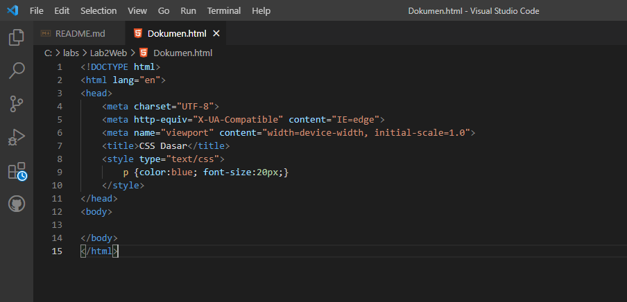
 Ketika sudah membuat seperti gambar yang diatas, jangan kalian run terlebih dahulu akan tetapi kalian ubah codingannya menjadi seperti gambar dibawah ini:
 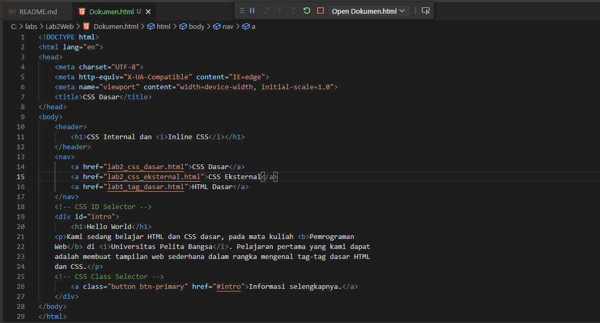
 Naah barulah kalian run, lalu kalian buka digoogle Crome atau dimicrosoft edge dan hasilnya seperti ini:
 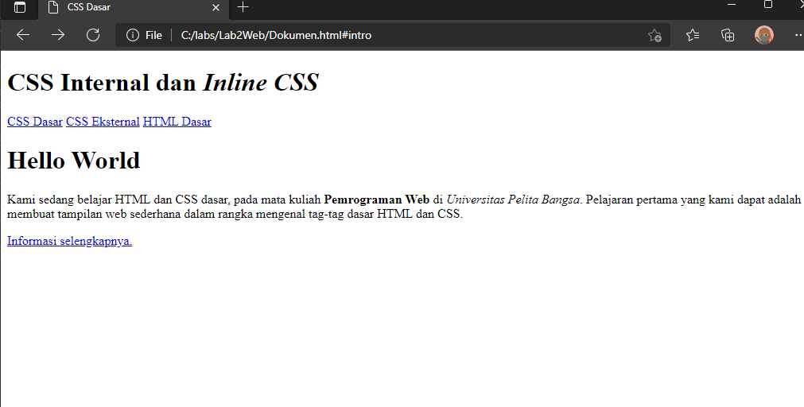
 
 2. Dan langkah berikutnya kalian mendeklarasikan ***CSS Internal*** caranya kalian menambahkan deklarasi CSS internal seperti berikut pada bagian head dokumen.
 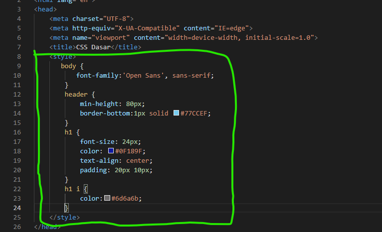
 Selanjutnya simpan perubahan yang ada, dan lakukan run, setelah itu kalian buka digoogle crome untuk melihat hasilnya.
 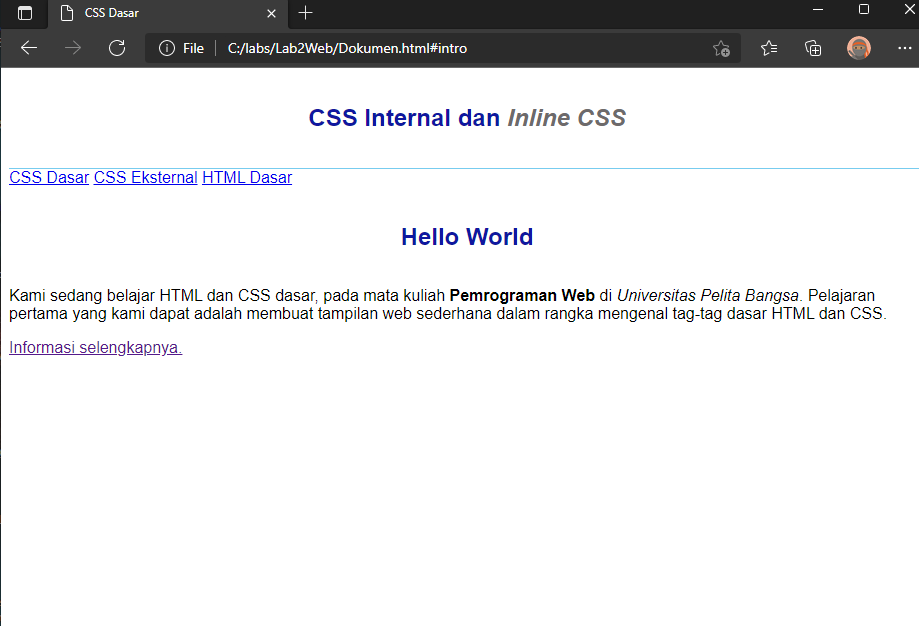
 
 3. Dan langkah selanjutnya kalian menambahkan ***Inline CSS*** caranya kalian tambahkan deklarasi inline CSS pada tag "p", seperti gambar berikut:
 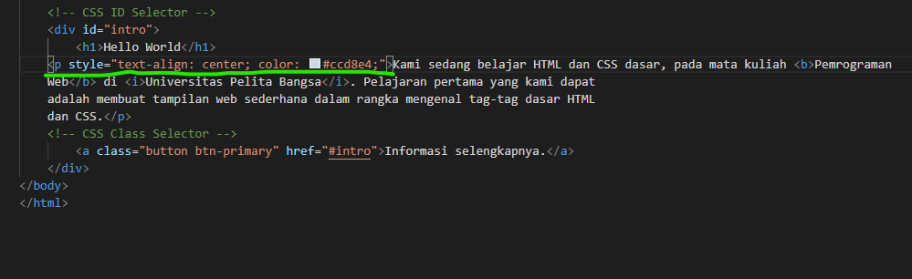
 Seperti biasa simpan kembali dan kalian run lalu kalian buka kembali digoogle crome untuk melihat perubahannya.
 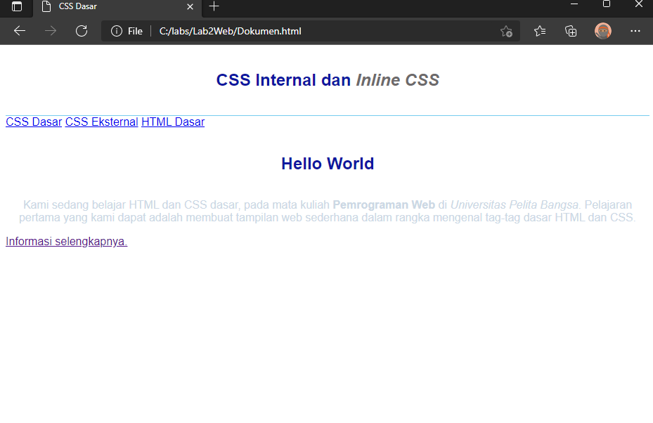
 
 4. Dan langkah berikutnya kalian membuat ***CSS eksternal*** dengan cara membuatlah file baru dengan nama **style_eksternal.css** kemudian buatlah deklarasi CSS seperti gambar berikut:
 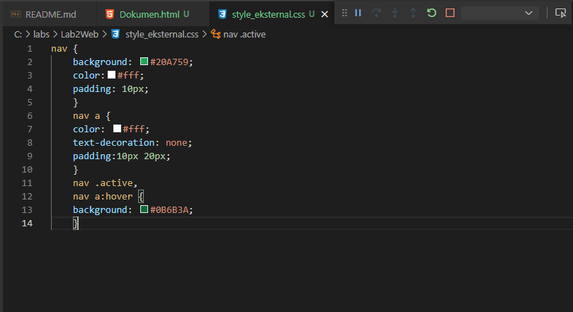
 Sebelum dirun kalian tambahkan tag "link" untuk merujuk file css yang sudah dibuat pada bagian "head" seperti gambar dibwah ini
 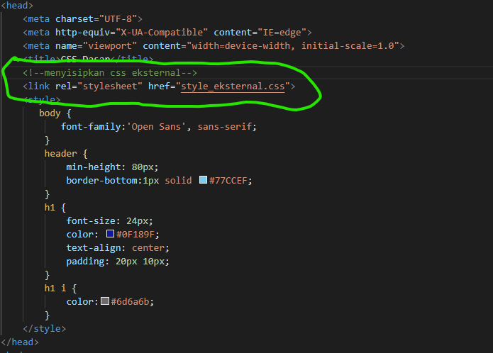
 Nah setelah itu kalian run, dan kalian buka kembali digoogle crome untuk melihat berubahannya
 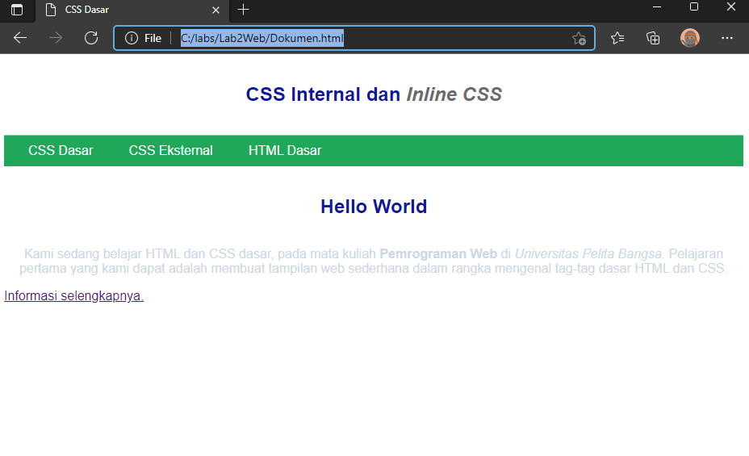
 
 5. Dan langkah terakhir kalian menambahkan ***CSS Selector*** menggunakan "ID" dan "Class Selector". Pada file **style_eksternal.css**, tambahkan kode berikut.
 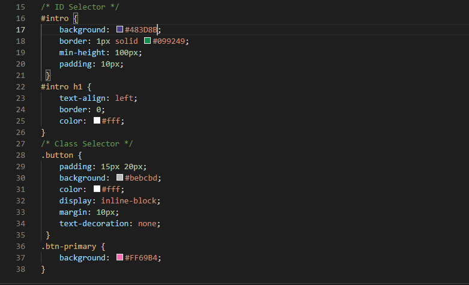
 Kemudian simpan kembali lalu kalian run, dan buka digoogle crome kembali untuk melihat perubahannya.
 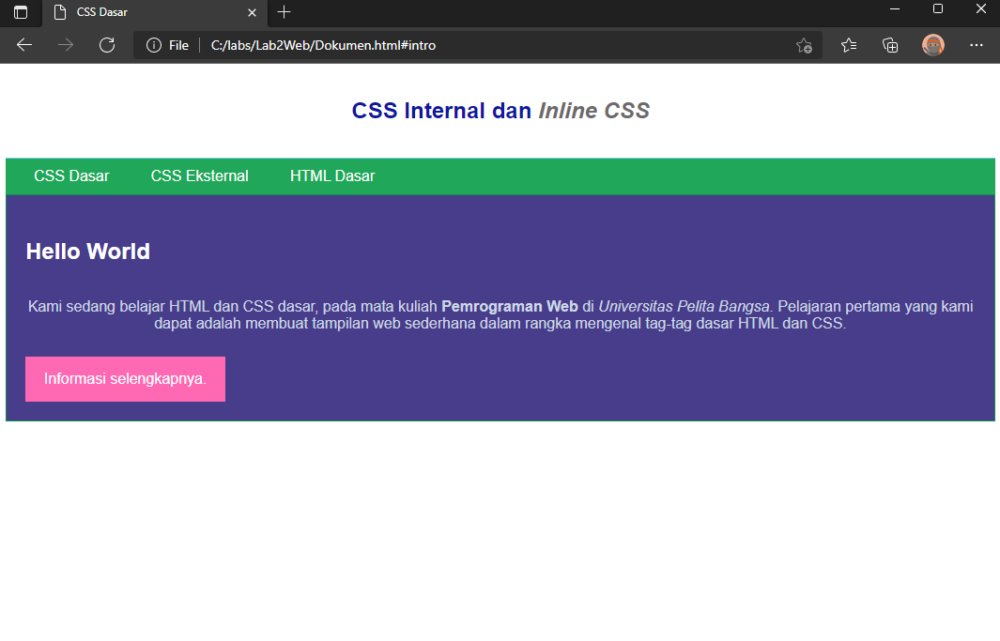
 

<b>sekian sampai disini pembahasan mengenai peraktikum CSS dasar, saya ucapkan terimakasi banyak, semoga bermanfaat untuk teman-teman semua :clap:</B>.
